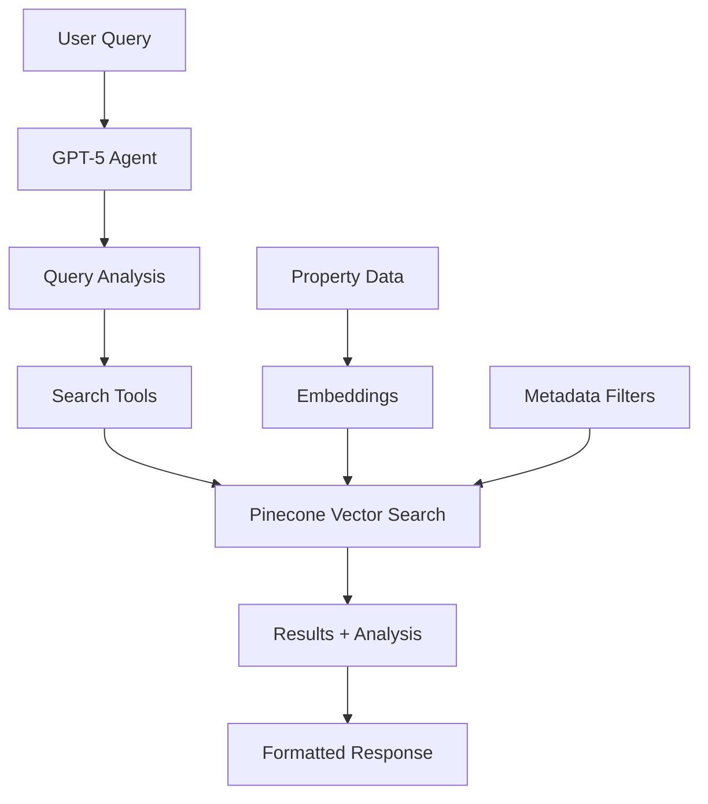

# 🏠 Real Estate AI Agent

> GPT-5 powered real estate agent with Pinecone hybrid search for intelligent property discovery

## ✨ Features

- **🤖 GPT-5 Integration**: Powered by OpenAI's latest GPT-5 model for intelligent conversation
- **🔍 Hybrid Search**: Combines semantic search with metadata filtering using Pinecone
- **🏘️ Smart Property Matching**: Natural language queries automatically converted to structured searches
- **📊 Market Insights**: AI-powered analysis and property comparisons
- **⚡ Real-time Results**: Fast vector search with relevance scoring

## 🚀 Quick Start

### 1. Clone the Repository

```bash
git clone https://github.com/PelaoDS/real-estate-ai-agent.git
cd real-estate-ai-agent
```

### 2. Install Dependencies

```bash
pip install -r requirements.txt
```

### 3. Setup Environment Variables

Copy the example environment file and fill in your API keys:

```bash
cp .env.example .env
```

Edit `.env` with your credentials:

```env
# OpenAI API Key (for GPT-5)
OPENAI_API_KEY=your_openai_api_key_here

# Pinecone Configuration
PINECONE_API_KEY=your_pinecone_api_key_here
PINECONE_ENVIRONMENT=us-east-1-aws
PINECONE_INDEX_NAME=real-estate-properties
```

### 4. Load Sample Data

```bash
python examples/sample_data_ingestion.py
```

### 5. Try the Agent

```bash
python examples/basic_usage.py
```

## 💬 Usage Examples

The agent understands natural language queries and automatically applies the right filters:

```python
from src.real_estate_agent.agent import real_estate_agent

# Natural language search
response = real_estate_agent.search_properties(
    "I want a 2 bedroom condo in Miami under $500k with a pool"
)

# The agent automatically:
# - Extracts filters: bedrooms=2, property_type=condo, city=Miami, max_price=500000
# - Searches for properties with "pool" in amenities
# - Returns formatted results with analysis
```

### Query Examples

```python
# Budget-focused search
"Show me apartments under $300k that allow pets"

# Location-specific search  
"Find luxury condos in Manhattan with city views"

# Feature-based search
"I need a house with at least 3 bedrooms and a fireplace"

# Lifestyle search
"Looking for a modern apartment with gym and pool amenities"
```

## 🏗️ Architecture



### Core Components

- **Agent (`agent.py`)**: GPT-5 powered conversational agent with search tools
- **Pinecone Client (`pinecone_client.py`)**: Vector database integration with LangChain
- **Schemas (`schemas.py`)**: Property data models and validation
- **Config (`config.py`)**: Application settings and environment variables

## 🛠️ Advanced Usage

### Custom Property Ingestion

```python
from src.real_estate_agent.schemas import PropertyListing, PropertyMetadata
from src.real_estate_agent.pinecone_client import pinecone_client

# Create property
metadata = PropertyMetadata(
    property_id="CUSTOM_001",
    property_type="house",
    price=450000,
    bedrooms=3,
    bathrooms=2.0,
    square_feet=1800,
    city="Austin",
    state="TX",
    # ... other fields
)

listing = PropertyListing(
    title="Beautiful Family Home",
    description="Spacious 3BR house in great neighborhood...",
    metadata=metadata
)

# Add to database
success = pinecone_client.upsert_property(listing)
```

### Direct Search API

```python
from src.real_estate_agent.pinecone_client import pinecone_client

# Direct search with filters
results = pinecone_client.search_properties(
    query="modern apartment with city views",
    filters={
        "city": "New York", 
        "min_bedrooms": 1,
        "max_price": 600000,
        "required_amenities": ["gym", "parking"]
    },
    top_k=5
)
```

## 🔧 Configuration

### Environment Variables

| Variable | Description | Default |
|----------|-------------|---------|
| `OPENAI_API_KEY` | OpenAI API key for GPT-5 | Required |
| `OPENAI_MODEL` | OpenAI model to use | `gpt-5` |
| `PINECONE_API_KEY` | Pinecone API key | Required |
| `PINECONE_INDEX_NAME` | Pinecone index name | `real-estate-properties` |
| `EMBEDDING_MODEL` | OpenAI embedding model | `text-embedding-3-small` |

### Property Schema

The system supports these property attributes:

- **Basic Info**: price, bedrooms, bathrooms, square_feet, property_type
- **Location**: city, state, neighborhood  
- **Features**: amenities, year_built, days_on_market
- **Agents**: listing_agent

### Supported Property Types

- House
- Apartment  
- Condo
- Townhouse
- Studio

### Available Amenities

- Pool, Gym, Parking
- Pet Friendly, Balcony
- Fireplace, Dishwasher
- Washer/Dryer, AC
- Hardwood Floors

## 🧪 Development

### Project Structure

```
real-estate-ai-agent/
├── src/real_estate_agent/    # Main package
│   ├── agent.py             # GPT-5 agent with tools
│   ├── pinecone_client.py   # Vector database client
│   ├── schemas.py           # Data models
│   └── config.py           # Settings
├── examples/                # Usage examples
├── tests/                   # Test suite
└── requirements.txt        # Dependencies
```

### Running Tests

```bash
pytest tests/
```

### Code Formatting

```bash
black src/ examples/
isort src/ examples/
```

## 🤝 Contributing

1. Fork the repository
2. Create a feature branch: `git checkout -b feature-name`
3. Make your changes and add tests
4. Run tests and formatting: `pytest && black . && isort .`
5. Submit a pull request

## 📄 License

MIT License - see [LICENSE](LICENSE) file for details.

## 🔗 Links

- [OpenAI GPT-5 Documentation](https://openai.com/gpt-5)
- [Pinecone Vector Database](https://pinecone.io)
- [LangChain Framework](https://langchain.com)

## 🆘 Support

Having issues? Please check:

1. **API Keys**: Ensure your OpenAI and Pinecone keys are valid
2. **Dependencies**: Run `pip install -r requirements.txt`  
3. **Environment**: Check your `.env` file matches `.env.example`

Open an issue if you need help!

---

Built with ❤️ using GPT-5 and Pinecone [Actually Claude wrote this hehe - Javier]